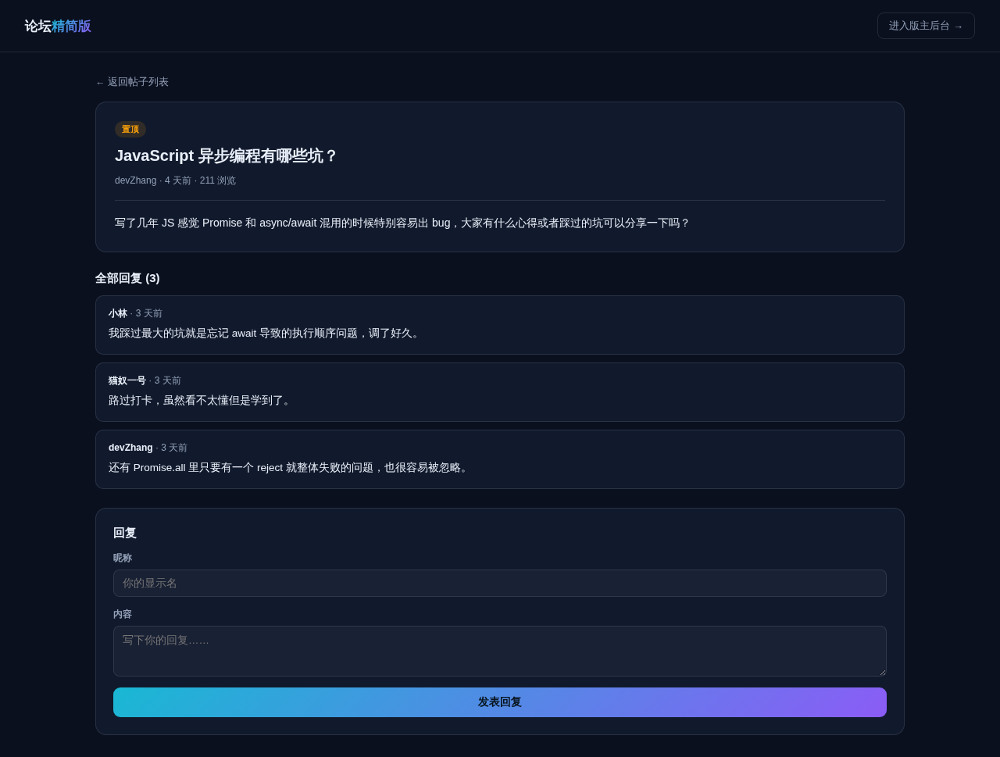

# 论坛系统（精简开源版）· Forum Lite

**[在线体验（前台）→](https://anna123123123-creator.github.io/forum-lite/)** · **[版主后台 →](https://anna123123123-creator.github.io/forum-lite/admin.html)**

免费开源的论坛/BBS 系统精简版。这不是截图或原型图，是一个**真实可用**的前后台系统：版块浏览、发帖回复、置顶与锁定，后台版主管理版块与内容、数据看板——都是真功能，纯前端 + `localStorage` 实现，不需要服务器、不需要数据库，克隆下来打开就能用，也适合作为学习或二次开发的起点。



## 功能

**前台（访客视角）**
- 版块列表浏览，展示每个版块的主题数
- 点开版块查看主题列表，置顶帖始终排在最前面，其余按发布时间倒序排列
- 无需注册登录，发帖 / 回复时填写一个昵称即可（轻量匿名论坛模式）
- 发布新主题，自动校验：昵称、标题、内容均为必填
- 点开主题查看完整内容和全部回复，回复自动校验：昵称、内容均为必填
- 被锁定的主题会隐藏回复表单，显示"该帖已被锁定，无法回复"
- 每次打开主题详情页浏览量 +1

**后台（版主视角）**
- 仪表盘：版块总数、主题总数、回复总数、最活跃版块（按主题数实时计算），最新主题列表
- 版块管理：新增、编辑、删除版块（删除会级联删除该版块下的所有主题和回复）
- 内容管理：查看全部主题（版块 / 作者 / 回复数 / 浏览数），一键置顶 / 取消置顶、锁定 / 解锁、删除主题

## 试用方法

克隆下来，直接用浏览器打开 `index.html`，或用静态文件服务器跑起来：

```bash
python3 -m http.server 8000
```

前台在 `index.html`，后台在 `admin.html`。所有数据存在浏览器的 `localStorage` 里（`forum_lite_data_v1` 这个 key），后台侧边栏有"重置示例数据"按钮可以随时清空重来。

## 技术说明

没有用任何框架或构建工具，纯原生 HTML/CSS/JavaScript，一共 5 个文件：`data.js`（数据层，负责 localStorage 读写和种子数据）、`index.html` + `script.js`（前台）、`admin.html` + `admin.js`（后台）。因为是纯前端 Demo，数据只存在当前浏览器里，不同设备 / 浏览器之间不会同步，也没有真实的用户账号体系（发帖只是简单记录一个昵称，任何人都能冒用他人昵称）——真实生产系统需要一个后端 API、数据库，以及完整的用户注册登录体系来替换 `data.js` 里的存储层，其余的界面和交互逻辑基本可以直接复用。

## 协议

MIT，随便怎么用都行。

## 相关项目

这是完整版**论坛系统**的精简开源示例——完整版支持用户注册登录与积分等级体系、敏感词过滤与内容审核、图片 / 附件上传、站内私信等能力，源码在这：[全能源码 · 论坛系统源码](https://inzyxuashop.com/luntan-yuanma.html)。
